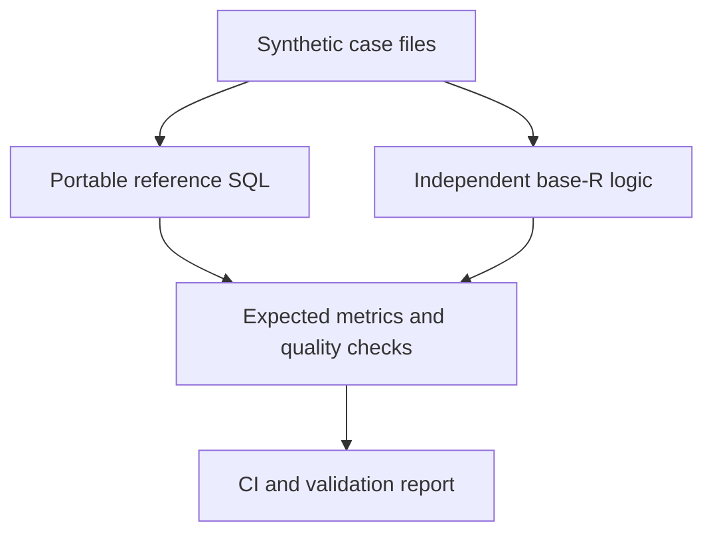

# Health Data Edge Cases

[](https://github.com/dfrbagley-cpu/health-data-edge-cases/actions/workflows/ci.yml)
[](LICENSE)

Deterministic synthetic test cases for healthcare operational reporting.

Many reporting errors do not look like software failures. The query runs, the dashboard loads, and the number is plausible—but duplicate versions, conflicting statuses, missing mappings, or mismatched periods have changed what the number means.

This repository provides small CSV fixtures, explicit expected results, portable reference SQL, and independent Python and R runners. Use it to test a reporting implementation or to teach why apparently reasonable logic fails.

**No real patient data, employer data, proprietary schemas, or licensed reporting specifications are included.**

For interactive, local-only reporting utilities, see the companion [Healthcare Reporting Toolkit](https://dfrbagley-cpu.github.io/healthcare-reporting-toolkit/).

## Quick start

Python 3.10 or later is the only local requirement. The reference runner has no third-party dependencies.

```bash
git clone https://github.com/dfrbagley-cpu/health-data-edge-cases.git
cd health-data-edge-cases
python scripts/run_suite.py
```

Expected result:

```text
PASS  appointment-encounter-status-conflict  (13 expectations)
PASS  duplicate-encounter-versions  (13 expectations)
PASS  like-for-like-partial-periods  (20 expectations)
PASS  unmapped-program-retention  (13 expectations)
PASS  suite: 4/4 cases, 59 expectations
```

Other useful commands:

```bash
python -m unittest discover -s tests -v
python scripts/run_suite.py --json
python -m pip install ".[duckdb]"
python scripts/run_duckdb.py
Rscript R/run_suite.R
make check
```

To verify the distributable package itself:

```bash
python -m pip install .
cd ..
health-data-edge-cases
python -m health_edge_cases
```

The installed wheel includes the synthetic fixtures and reference SQL, so both commands work outside the source checkout. Add the optional DuckDB verifier with `python -m pip install ".[duckdb]"` before leaving the checkout.

The committed [validation report](docs/index.html) explains each failure mode and shows expected versus actual results.

## Included cases

| Case | What naive logic gets wrong | Contract tested |
|---|---|---|
| [Duplicate encounter versions](cases/duplicate-encounter-versions) | Counts four completed rows instead of two current service events | Rank versions, keep one current event, then apply status |
| [Appointment/encounter conflict](cases/appointment-encounter-status-conflict) | Drops delivered care because scheduling status says cancelled | Count service from the encounter; flag the status conflict separately |
| [Unmapped program retention](cases/unmapped-program-retention) | Silently loses half the activity through an inner join | Preserve source activity and expose unmapped records |
| [Like-for-like partial periods](cases/like-for-like-partial-periods) | Compares unequal elapsed periods | Make both inclusive as-of windows explicit |

These are test contracts, not universal clinical, regulatory, or billing rules. A production implementation should state its own source-of-truth decisions just as explicitly.

## How the suite works

Each case is a self-contained directory:

```text
case.json
programs.csv
program_mappings.csv
referrals.csv
appointments.csv
encounters.csv
reporting_periods.csv
expected_metrics.csv
expected_quality.csv
```

The Python runner loads each case into an in-memory SQLite database, executes [`sql/reference.sql`](sql/reference.sql), and compares every returned value with the committed expectations. CI also executes the same SQL and expectations in pinned DuckDB 1.5.5; DuckDB is optional for local use.

The base-R implementation in [`R/reference_metrics.R`](R/reference_metrics.R) calculates the same answers independently rather than calling the SQL. CI runs both paths, which helps detect an error in the reference implementation itself.



## Reference rules in v0.1

1. A source event may have several rows. The highest version wins; update time and row ID break ties deterministically.
2. Only the current event version can contribute to service metrics.
3. A current completed encounter is the suite's evidence that service occurred. A contradictory appointment status is reported as a quality issue.
4. Program mappings are left-joined. An unmapped event remains in total activity and is also counted as unmapped.
5. Reporting-period boundaries are inclusive and represented as input data.
6. A referral reaches first service only when a current completed encounter is linked to it on or after the referral timestamp.

See the [data dictionary](docs/DATA_DICTIONARY.md) for exact fields, metrics, and checks.

## Use it with another reporting stack

You do not need Python, R, or SQLite in production:

1. Load one case's input CSV files into your database or transformation tool.
2. Run your own reporting logic.
3. Export results using the keys in `expected_metrics.csv` and `expected_quality.csv`.
4. Compare your values with the committed expectations.

The cases are intentionally small enough to inspect by eye. If an implementation disagrees, the case narrative provides a precise place to examine its assumptions.

## Scope and boundaries

This project is:

- a reusable conformance and teaching suite;
- implementation-neutral fixture data with known answers;
- a place to discuss operational reporting edge cases openly.

It is not:

- clinical decision support;
- a certification, regulatory submission tool, or statement of official policy;
- a comprehensive healthcare data model;
- a synthetic patient-record generator;
- a public edition of any commercial reporting platform.

All identifiers are obvious synthetic tokens. Do not submit real health information, employer-derived data, confidential mappings, copied vendor schemas, or text from licensed standards.

The companion toolkit and this suite are independently designed portfolio projects. Neither represents an employer, reporting authority, or universal healthcare standard.

## Add a case

Start with [Adding a case](docs/ADDING_A_CASE.md) and use the edge-case issue template. A useful contribution must contain one narrow failure mode, the smallest fixture that proves it, and an expected result that can be defended without private or licensed material.

## Versioning

The project follows semantic versioning:

- patch: documentation or implementation fixes that do not change a case's expected meaning;
- minor: new cases, metrics, or additive schema fields;
- major: incompatible fixture or contract changes.

Expected results are part of the public contract. Changing one requires a clear rationale in the changelog.

## Licence and citation

Code, documentation, and synthetic fixtures are available under the [Apache License 2.0](LICENSE). See [`CITATION.cff`](CITATION.cff) for citation metadata.

Contributions are welcome under the same licence.
