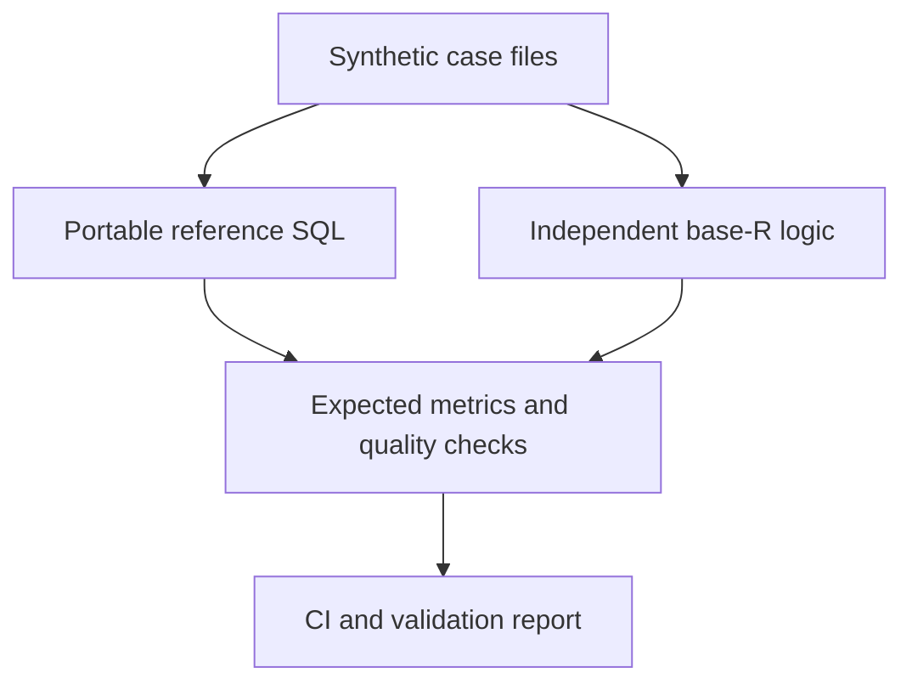

# Health Data Edge Cases

[](https://github.com/dfrbagley-cpu/health-data-edge-cases/actions/workflows/ci.yml)
[](https://dfrbagley-cpu.github.io/health-data-edge-cases/)
[](LICENSE)

Deterministic synthetic test cases for healthcare operational reporting.

Many reporting errors do not look like software failures. The query runs, the dashboard loads, and the number is plausible—but duplicate versions, conflicting statuses, missing mappings, or mismatched periods have changed what the number means.

This repository provides small CSV fixtures, explicit expected results, portable reference SQL executed in SQLite and DuckDB through Python validation and orchestration, and an independent base-R cross-check. Use it as a repeatable regression and conformance check for a reporting implementation, or to teach why apparently reasonable logic fails.

**No real patient data, employer data, proprietary schemas, or licensed reporting specifications are included.**

For interactive, local-only reporting utilities, see the companion [Healthcare Reporting Toolkit](https://dfrbagley-cpu.github.io/healthcare-reporting-toolkit/).

## Product case study

**Intended users.** Healthcare analytics and data-platform teams turning changing source data into trustworthy operational measures.

**Problem.** A pipeline can run successfully and still return plausible but incorrect results when source versions, mappings, statuses, relationship keys, or event grain are inconsistent.

**Product decision.** I chose small, implementation-neutral synthetic contracts rather than a vendor-specific healthcare model. Each case isolates one consequential failure mode, states the governing rule, and provides a verifiable answer.

**My role.** I selected the problems; defined the healthcare-domain rules; designed the schemas and contracts; set scope, priorities, and acceptance criteria; directed the user experience; and validated the results. AI-assisted development and a [credited open-source contribution](https://github.com/dfrbagley-cpu/health-data-edge-cases/pull/8) accelerated implementation; responsibility for product decisions and validation remained mine.

**Evidence.** Five failure modes contain 72 executable expectations. Portable SQL runs in SQLite and DuckDB through a Python validation and orchestration harness, the calculations are cross-checked by an independent base-R implementation, and a versioned, digest-bound contract catalogue supports downstream consumers.

**Boundaries.** This is an implementation-neutral public conformance tool: not certification, an official reporting standard, or a hospital production implementation. It contains no patient information, employer data, licensed standards, or proprietary vendor schemas. The repository's [publication policy](PUBLICATION_POLICY.md) keeps all public work separate from non-public code, data, schemas, identifiers, branding, and roadmaps.

Across the public portfolio, the trusted-data path is: **synthetic source fixtures → structural validation → governed transformations → expected metrics and quality signals → versioned contract catalogue → pinned [Toolkit](https://dfrbagley-cpu.github.io/healthcare-reporting-toolkit/) consumer → exportable analysis receipts**.

## Quick start

Python 3.10 or later is the only local requirement. The reference runner has no third-party dependencies.

```bash
git clone https://github.com/dfrbagley-cpu/health-data-edge-cases.git
cd health-data-edge-cases
python scripts/run_suite.py
```

Expected result:

```text
PASS  appointment-encounter-status-conflict  (13 expectations)
PASS  duplicate-encounter-versions  (13 expectations)
PASS  like-for-like-partial-periods  (20 expectations)
PASS  many-to-many-join-inflation  (13 expectations)
PASS  unmapped-program-retention  (13 expectations)
PASS  suite: 5/5 cases, 72 expectations
```

Other useful commands:

```bash
python -m unittest discover -s tests -v
python scripts/run_suite.py --json
python -m pip install ".[duckdb]"
python scripts/run_duckdb.py
Rscript R/run_suite.R
python -m health_edge_cases validate-case cases/unmapped-program-retention
python -m health_edge_cases manifest
python -m health_edge_cases --version
make check
```

## Integrate a reporting pipeline

Create a version-bound workspace instead of manually copying fixtures and
constructing the verifier's exact result tree:

```bash
python -m health_edge_cases scaffold ../edge-integration
cd ../edge-integration
```

The command publishes the workspace atomically at a new destination and refuses
to replace an existing file, directory, or symlink. It copies only the public
case manifest and six synthetic input CSVs for each case—never the expected
output values—and creates header-only aggregate result templates.
Atomic no-replace publication uses the native operation available on Windows,
Linux, and macOS; on a platform without that guarantee, the command exits `2`
without publishing a partial workspace.

The version-and-catalog-bound `result-keys.json` file lists the exact metric and
quality key tuples each pipeline export must contain, without publishing any
expected values into the integration workspace. Use those tuples to shape the
rows written to the result templates; `verify` remains the source of truth for
the comparison.

Run the production-equivalent transformation you want to test against each
`fixtures/<case>/` directory, shape its rows from `result-keys.json`, write the
aggregate outputs to the matching `results/<case>/actual_metrics.csv` and
`actual_quality.csv`, then verify all cases at once:

```bash
health-data-edge-cases verify \
  --results results \
  --json-output verification-result.json \
  --junit-output verification-junit.xml
```

An untouched scaffold is a valid empty result set and exits `1` with all
expectations reported missing. Matching populated outputs exit `0`; malformed
files exit `2`. This makes the initial fail-to-pass integration path explicit
without executing a downstream system's code inside the verifier.

To verify the distributable package itself:

```bash
python -m pip install .
cd ..
health-data-edge-cases
python -m health_edge_cases
```

The installed wheel includes the synthetic fixtures and reference SQL, so both commands work outside the source checkout. Add the optional DuckDB verifier with `python -m pip install ".[duckdb]"` before leaving the checkout.

The [live validation report](https://dfrbagley-cpu.github.io/health-data-edge-cases/) explains each failure mode and shows expected versus actual results. It is deployed directly from the verified, committed [`docs/index.html`](docs/index.html) artifact.

The versioned [public contract catalog](https://dfrbagley-cpu.github.io/health-data-edge-cases/contracts/catalog-v1.json) publishes every case narrative and expected result in one deterministic JSON artifact. Its [JSON Schema](schema/contract-catalog.schema.json) defines the consumer contract, and its SHA-256 digest covers all catalog content and provenance except the digest field itself.

## Included cases

| Case | What naive logic gets wrong | Contract tested |
|---|---|---|
| [Duplicate encounter versions](cases/duplicate-encounter-versions) | Counts four completed rows instead of two current service events | Rank versions, keep one current event, then apply status |
| [Appointment/encounter conflict](cases/appointment-encounter-status-conflict) | Drops delivered care because scheduling status says cancelled | Count service from the encounter; flag the status conflict separately |
| [Unmapped program retention](cases/unmapped-program-retention) | Silently loses half the activity through an inner join | Preserve source activity and expose unmapped records |
| [Like-for-like partial periods](cases/like-for-like-partial-periods) | Compares unequal elapsed periods | Make both inclusive as-of windows explicit |
| [Many-to-many join inflation](cases/many-to-many-join-inflation) | Turns two referrals and two services into four joined rows | Join on explicit relationship keys and restore event grain before aggregation |

These are test contracts, not universal clinical, regulatory, or billing rules. A production implementation should state its own source-of-truth decisions just as explicitly.

## How the suite works

Each case is a self-contained directory:

```text
case.json
programs.csv
program_mappings.csv
referrals.csv
appointments.csv
encounters.csv
reporting_periods.csv
expected_metrics.csv
expected_quality.csv
```

The Python runner loads each case into an in-memory SQLite database, executes [`sql/reference.sql`](sql/reference.sql), and compares every returned value with the committed expectations. CI also executes the same SQL and expectations in pinned DuckDB 1.5.5; DuckDB is optional for local use.

The base-R implementation in [`R/reference_metrics.R`](R/reference_metrics.R) calculates the same answers independently rather than calling the SQL. CI runs both paths, which helps detect an error in the reference implementation itself.


```mermaid
flowchart TD
    A["Synthetic case files"] --> B["Portable reference SQL"]
    A --> C["Independent base-R logic"]
    B --> D["Expected metrics and quality checks"]
    C --> D
    D --> E["CI and validation report"]
```

## Reference rules

1. A source event may have several rows. The highest version wins; update time and row ID break ties deterministically.
2. Only the current event version can contribute to service metrics.
3. A current completed encounter is the suite's evidence that service occurred. A contradictory appointment status is reported as a quality issue.
4. Program mappings are left-joined. An unmapped event remains in total activity and is also counted as unmapped.
5. Reporting-period boundaries are inclusive and represented as input data.
6. A referral reaches first service only when a current completed encounter is linked to it on or after the referral timestamp.
7. Fixture timestamps use exact UTC `YYYY-MM-DDTHH:MM:SSZ` text; reporting dates use exact `YYYY-MM-DD` text and a period cannot end before it starts.
8. Non-empty encounter referral and appointment links must resolve to their case-local source rows.

See the [data dictionary](docs/DATA_DICTIONARY.md) for exact fields, metrics, and checks.

## Use it with another reporting stack

You do not need Python, R, or SQLite in production:

1. Load one case's input CSV files into your database or transformation tool.
2. Run your own reporting logic.
3. Export results using the keys in `expected_metrics.csv` and `expected_quality.csv`.
4. Compare your values with the committed expectations.

See the [external-results walkthrough](docs/COMPARE_RESULTS.md) for the file contract, matching and deliberately failing synthetic exports, and careful diagnostic interpretation.

Export metrics and quality checks with the **exact** headers required by that contract:

- `actual_metrics.csv`: `period_id,metric_id,actual_value`
- `actual_quality.csv`: `check_id,actual_value`

Keys cannot be blank or duplicated. Values use base-10 integer text with an
optional sign; decimals, exponents and Unicode digits are rejected. Then compare
without running the reference SQL:

```bash
python scripts/compare_results.py \
  --case unmapped-program-retention \
  --metrics examples/external-results/unmapped-program-retention/matching/actual_metrics.csv \
  --quality examples/external-results/unmapped-program-retention/matching/actual_quality.csv
```

The command exits non-zero on any missing, unexpected, or incorrect key and prints the mismatches clearly.

To verify all five external result pairs in one version-bound CI operation, use
the [`verify` command or composite GitHub Action](docs/VERIFY_SUITE.md). It emits
console, versioned JSON, JUnit XML, and a GitHub workflow summary without running
customer commands or making network requests.

The cases are intentionally small enough to inspect by eye. If an implementation disagrees, the case narrative provides a precise place to examine its assumptions.

## Scope and boundaries

This project is:

- a reusable conformance and teaching suite;
- implementation-neutral fixture data with known answers;
- a place to discuss operational reporting edge cases openly.

It is not:

- clinical decision support;
- a certification, regulatory submission tool, or statement of official policy;
- a comprehensive healthcare data model;
- a synthetic patient-record generator;
- a public edition of any commercial reporting platform.

All identifiers are obvious synthetic tokens. Do not submit real health information, employer-derived data, confidential mappings, copied vendor schemas, or text from licensed standards.

The companion toolkit and this suite are independently designed public projects. Neither represents an employer, reporting authority, or universal healthcare standard.

## Add a case

Start with [Adding a case](docs/ADDING_A_CASE.md), review the [publication policy](PUBLICATION_POLICY.md), and use the edge-case issue template. A useful contribution must contain one narrow failure mode, the smallest fixture that proves it, and an expected result that can be defended without private or licensed material.

## Versioning

The project follows semantic versioning:

- patch: documentation or implementation fixes that do not change a case's expected meaning;
- minor: new cases, commands, metrics, or other additive contract capabilities;
- major: incompatible fixture or contract changes.

Expected results are part of the public contract. Changing one requires a clear rationale in the changelog.

## Licence and citation

Code, documentation, and synthetic fixtures are available under the [Apache License 2.0](LICENSE). See [`CITATION.cff`](CITATION.cff) for citation metadata.

Contributions are welcome under the same licence.
