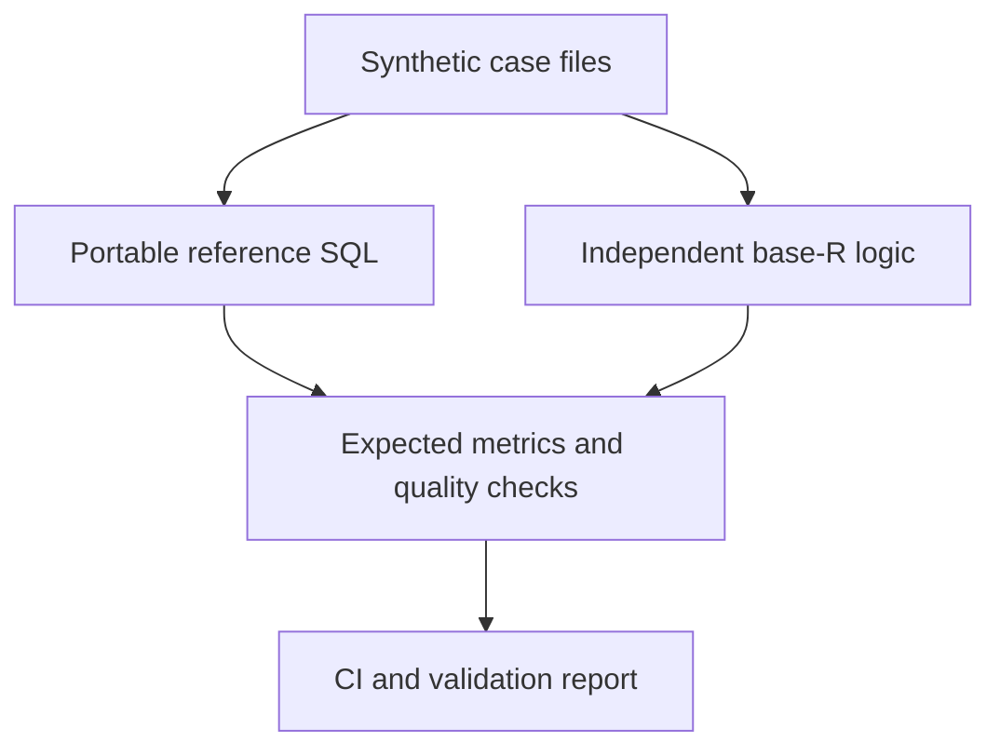

# Running and integrating the suite

Start with the [README quick start](../README.md#run-the-suite-locally).
The commands below assume a source checkout and Python 3.10 or later. Use an
activated virtual environment when installing the optional dependencies or the
package. The basic reference run needs no installation.

## Windows terminals

Run each command in this guide on one line. Some linked guides use Bash-style
`\` line continuations; in PowerShell or Command Prompt, join those lines and
remove the continuation backslashes.

To record a Python command's exit code, run `$LASTEXITCODE` in PowerShell or
`echo %ERRORLEVEL%` in Command Prompt immediately after that command. Record the
exact output of `python --version` when sharing results, along with the Windows
edition and version actually tested. A minimum requirement such as "Python
3.10+" does not identify the tested environment.

## More local commands

Run the dependency-free checks from the repository root:

```bash
python -m unittest discover -s tests -v
python scripts/run_suite.py --json
python -m health_edge_cases validate-case cases/unmapped-program-retention
python -m health_edge_cases manifest
python -m health_edge_cases --version
```

`make check` is a convenience target if Make is installed. To also run the
optional DuckDB implementation, use `python -m pip install ".[duckdb]"` followed
by `python scripts/run_duckdb.py`. If R is installed, run `Rscript R/run_suite.R`.

## Integrate a reporting pipeline

Create a version-bound workspace instead of manually copying fixtures and
constructing the verifier's exact result tree:

```bash
python -m pip install .
python -m health_edge_cases scaffold ../edge-integration
cd ../edge-integration
python -m health_edge_cases verify --results results
```

The last command checks the newly created, empty result templates. It should
report all 72 expectations missing and exit `1`. This is the expected starting
point; scaffolding does not run a transformation or fill in its answers.

**`--results` must point to the workspace's `results` subfolder.** The workspace
root also holds `fixtures`, `README.md`, and `result-keys.json`, which are not
verification inputs. Choose the path relative to your current directory:

| Current directory | Command |
|---|---|
| Inside `edge-integration` | `python -m health_edge_cases verify --results results` |
| Parent of `edge-integration` | `python -m health_edge_cases verify --results edge-integration/results` |

If `ERROR ... entries differ` lists `fixtures`, `result-keys.json`, and `results`
as unexpected, you selected the workspace root. Point `--results` to its
`results` subfolder; do not move or delete the generated files to fix this error.

The scaffold command publishes the workspace atomically at a new destination and refuses
to replace an existing file, directory, or symlink. It copies only the public
case manifest and six synthetic input CSVs for each case—never the expected
output values—and creates header-only aggregate result templates.
Atomic no-replace publication uses the native operation available on Windows,
Linux, and macOS; on a platform without that guarantee, the command exits `2`
without publishing a partial workspace.

The version-and-catalog-bound `result-keys.json` file lists the exact metric and
quality key tuples each pipeline export must contain, without publishing any
expected values into the integration workspace. Use those tuples to shape the
rows written to the result templates; `verify` remains the source of truth for
the comparison.

Run the production-equivalent transformation you want to test against each
`fixtures/<case>/` directory, shape its rows from `result-keys.json`, write the
aggregate outputs to the matching `results/<case>/actual_metrics.csv` and
`actual_quality.csv`, then verify all cases at once:

```bash
python -m health_edge_cases verify --results results --json-output verification-result.json --junit-output verification-junit.xml
```

An untouched scaffold is a valid empty result set and exits `1` with all
expectations reported missing. Matching populated outputs exit `0`; malformed
files exit `2`. This makes the initial fail-to-pass integration path explicit
without executing a downstream system's code inside the verifier.

## Check the installed package

Start from the source checkout in an activated virtual environment. This is a
separate workflow from the integration workspace above:

```bash
python -m pip install .
cd ..
health-data-edge-cases
python -m health_edge_cases
```

The installed wheel includes the synthetic fixtures and reference SQL, so both commands work outside the source checkout. Add the optional DuckDB verifier with `python -m pip install ".[duckdb]"` before leaving the checkout.

A reference run from inside the checkout can import the local source. To verify
the installed package, keep the same virtual environment active, leave the
checkout as shown above, and confirm the run still reports five cases and 72
expectations passing.

The [live validation report](https://dfrbagley-cpu.github.io/health-data-edge-cases/) explains each failure mode and shows expected versus actual results. It is deployed directly from the verified, committed [`docs/index.html`](index.html) artifact.

The versioned [public contract catalog](https://dfrbagley-cpu.github.io/health-data-edge-cases/contracts/catalog-v1.json) publishes every case narrative and expected result in one deterministic JSON artifact. Its [JSON Schema](../schema/contract-catalog.schema.json) defines the consumer contract, and its SHA-256 digest covers all catalog content and provenance except the digest field itself.

See [Compare external reporting results](COMPARE_RESULTS.md) for exact CSV
headers and a single-case comparison. See [Verify a complete external result
set](VERIFY_SUITE.md) for the result tree, manifests, exit codes, and GitHub Action.

## How the suite works

Each case is a self-contained directory:

```text
case.json
programs.csv
program_mappings.csv
referrals.csv
appointments.csv
encounters.csv
reporting_periods.csv
expected_metrics.csv
expected_quality.csv
```

The Python runner loads each case into an in-memory SQLite database, executes [`sql/reference.sql`](../sql/reference.sql), and compares every returned value with the committed expectations. CI also executes the same SQL and expectations in pinned DuckDB 1.5.5; DuckDB is optional for local use.

The base-R implementation in [`R/reference_metrics.R`](../R/reference_metrics.R) calculates the same answers independently rather than calling the SQL. CI runs both paths, which helps detect an error in the reference implementation itself.



## Reference rules

1. A source event may have several rows. The highest version wins; update time and row ID break ties deterministically.
2. Only the current event version can contribute to service metrics.
3. A current completed encounter is the suite's evidence that service occurred. A contradictory appointment status is reported as a quality issue.
4. Program mappings are left-joined. An unmapped event remains in total activity and is also counted as unmapped.
5. Reporting-period boundaries are inclusive and represented as input data.
6. A referral reaches first service only when a current completed encounter is linked to it on or after the referral timestamp.
7. Fixture timestamps use exact UTC `YYYY-MM-DDTHH:MM:SSZ` text; reporting dates use exact `YYYY-MM-DD` text and a period cannot end before it starts.
8. Non-empty encounter referral and appointment links must resolve to their case-local source rows.

See the [data dictionary](DATA_DICTIONARY.md) for exact fields, metrics, and checks.

## Versioning

The project follows semantic versioning:

- patch: documentation or implementation fixes that do not change a case's expected meaning;
- minor: new cases, commands, metrics, or other additive contract capabilities;
- major: incompatible fixture or contract changes.

Expected results are part of the public contract. Changing one requires a clear rationale in the changelog.

[Back to the repository](../README.md)
